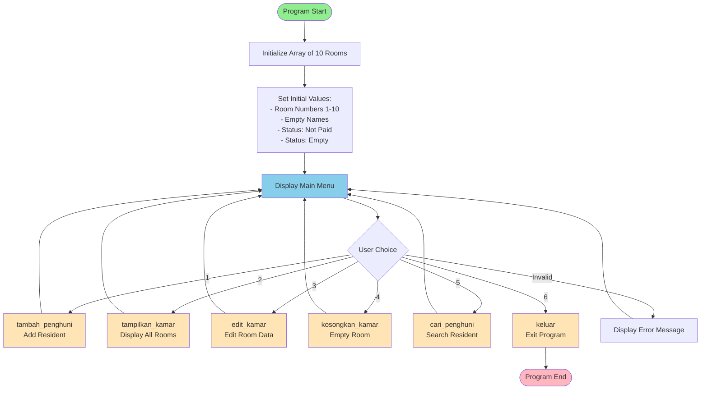
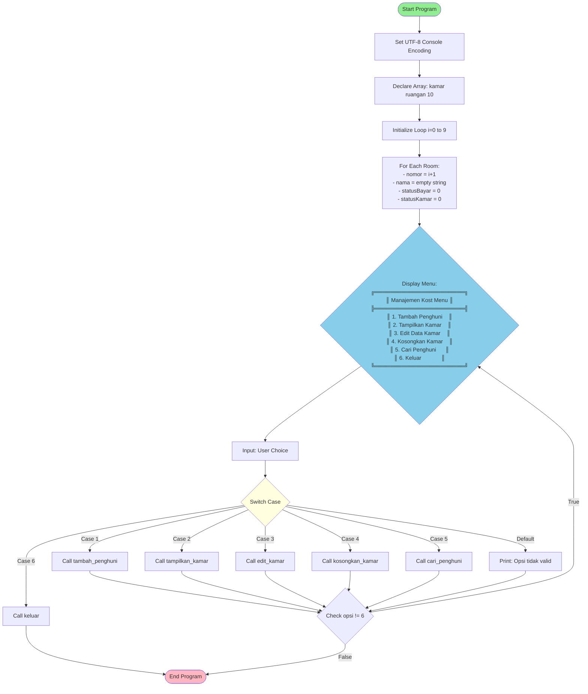
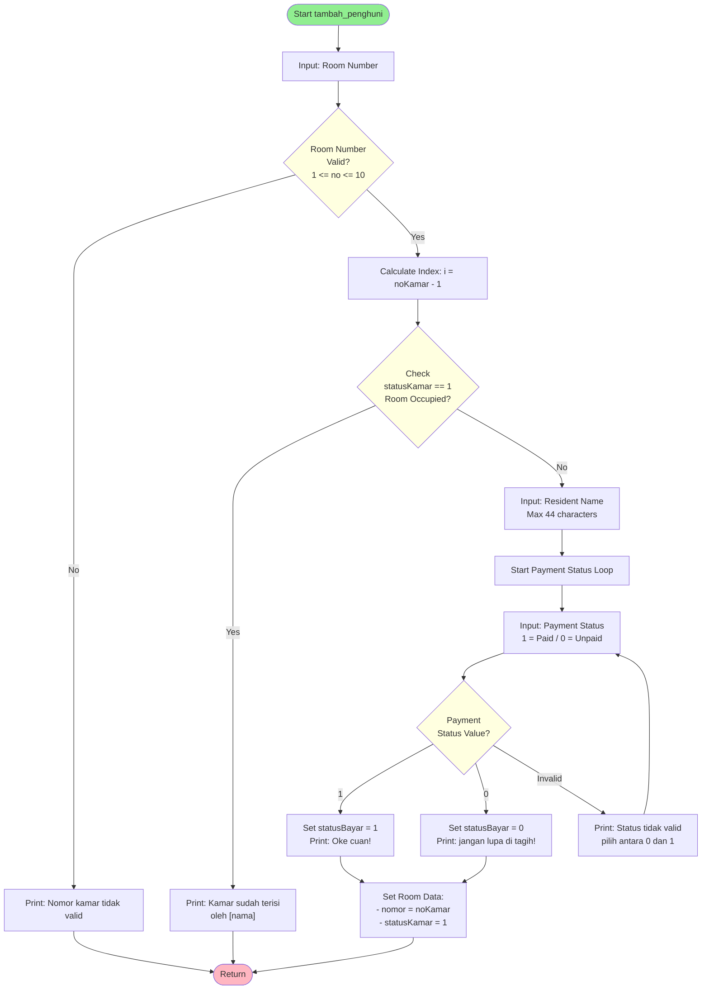
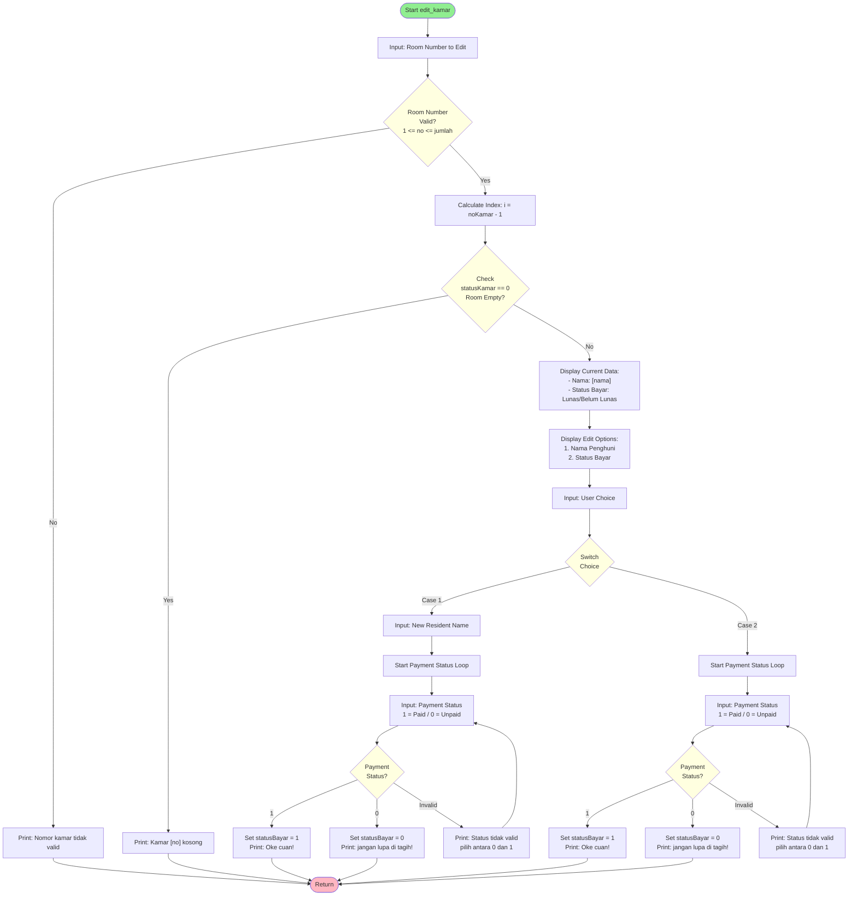
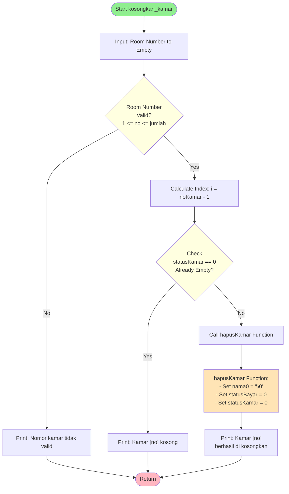
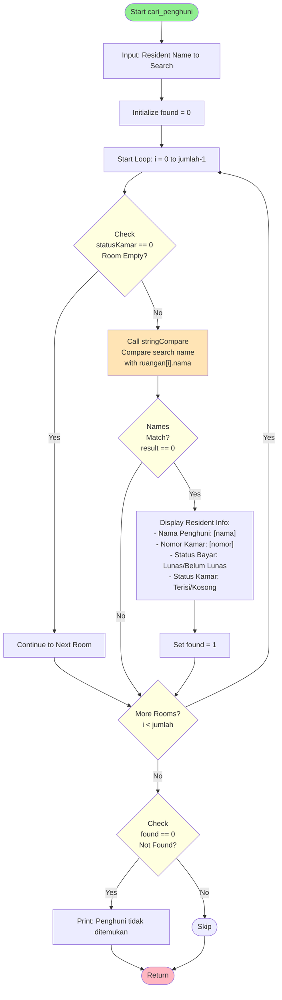
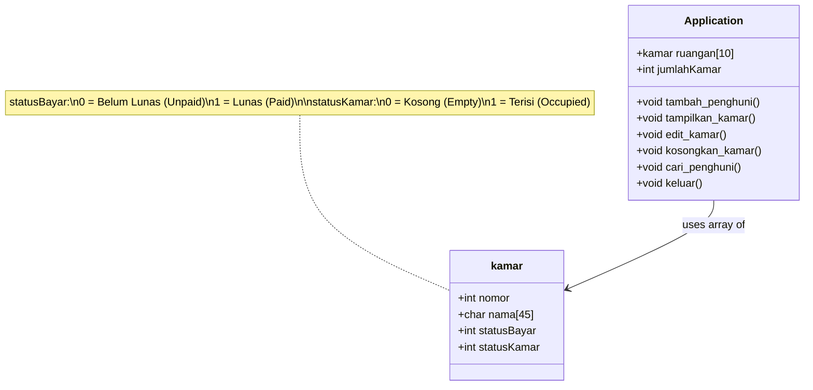

# Boarding House Management System - Flowcharts

This document contains comprehensive flowcharts for the entire boarding house management system project.

## Table of Contents
1. [System Architecture](#system-architecture)
2. [Main Program Flow](#main-program-flow)
3. [Add Resident (tambahPenghuni)](#add-resident-tambahpenghuni)
4. [Display Rooms (tampilkanKamar)](#display-rooms-tampilkankamar)
5. [Edit Room (editKamar)](#edit-room-editkamar)
6. [Empty Room (kosongkanKamar)](#empty-room-kosongkankamar)
7. [Search Resident (cariPenghuni)](#search-resident-caripenghuni)
8. [Data Structure](#data-structure)

---

## System Architecture



---

## Main Program Flow



---

## Add Resident (tambahPenghuni)



---

## Display Rooms (tampilkanKamar)

```mermaid
flowchart TD
    A([Start tampilkan_kamar]) --> B[Print Table Header:<br/>+----------+----------------------+---------------+----------------+<br/>| No Kamar | Nama | Status Kamar | Status Bayar |]
    
    B --> C[Start Loop: i = 0 to jumlah-1]
    
    C --> D[Set no = i + 1]
    D --> E{Check<br/>statusKamar == 0<br/>Empty Room?}
    
    E -->|Yes| F["Set Display Values:<br/>- nama = '-'<br/>- statusKamar = 'Kosong'<br/>- statusBayar = '-'"]
    
    E -->|No| G{Check<br/>nama0 == '\\0'<br/>Name Empty?}
    
    G -->|Yes| H["Set nama = '-'"]
    G -->|No| I["Set nama = ruangan[i].nama"]
    
    H --> J["Set statusKamar = 'Terisi'"]
    I --> J
    
    J --> K{Check<br/>statusBayar == 1<br/>Paid?}
    
    K -->|Yes| L["Set statusBayar = 'Lunas'"]
    K -->|No| M["Set statusBayar = 'Belum Lunas'"]
    
    F --> N["Print Row:<br/>| no | nama | statusKamar | statusBayar |"]
    L --> N
    M --> N
    
    N --> O{More Rooms?<br/>i < jumlah}
    
    O -->|Yes| D
    O -->|No| P[Print Table Footer:<br/>+----------+----------------------+---------------+----------------+]
    
    P --> Z([Return])
    
    style A fill:#90EE90
    style Z fill:#FFB6C1
    style E fill:#FFFFE0
    style G fill:#FFFFE0
    style K fill:#FFFFE0
    style O fill:#FFFFE0
```

---

## Edit Room (editKamar)



---

## Empty Room (kosongkanKamar)



---

## Search Resident (cariPenghuni)



### String Compare Helper Function

```mermaid
flowchart TD
    A([Start stringCompare]) --> B["Input Parameters:<br/>- str1[]: Search String<br/>- str2[]: Target String"]
    B --> C[Initialize i = 0]
    C --> D{Check<br/>str1[i] == str2[i]}
    
    D -->|No| E["Return<br/>str1[i] - str2[i]"]
    
    D -->|Yes| F{Check<br/>str1[i] == '\\0' OR<br/>str2[i] == '\\0'<br/>End of String?}
    
    F -->|Yes| E
    F -->|No| G[Increment i++]
    G --> D
    
    E --> Z([Return Result:<br/>0 = Match<br/>!= 0 = Different])
    
    style A fill:#90EE90
    style Z fill:#FFB6C1
    style D fill:#FFFFE0
    style F fill:#FFFFE0
```

---

## Data Structure



### Data Structure Details

**kamar struct:**
- `nomor` (int): Room number (1-10)
- `nama` (char[45]): Resident name (max 44 characters + null terminator)
- `statusBayar` (int): Payment status
  - `0` = Belum Lunas (Unpaid)
  - `1` = Lunas (Paid)
- `statusKamar` (int): Room occupancy status
  - `0` = Kosong (Empty)
  - `1` = Terisi (Occupied)

**Global Constants:**
- `jumlahKamar`: Fixed value of 10 rooms

---

## Program Files Overview

| File | Function | Description |
|------|----------|-------------|
| [main.c](file:///d:/INFORMATIKA/Pengenalan%20Pemrograman/project_akhir/main.c) | main() | Entry point, menu loop, dispatch functions |
| [tambahPenghuni.c](file:///d:/INFORMATIKA/Pengenalan%20Pemrograman/project_akhir/tambahPenghuni.c) | tambah_penghuni() | Add new resident to a room |
| [tampilkanKamar.c](file:///d:/INFORMATIKA/Pengenalan%20Pemrograman/project_akhir/tampilkanKamar.c) | tampilkan_kamar() | Display all rooms in table format |
| [editKamar.c](file:///d:/INFORMATIKA/Pengenalan%20Pemrograman/project_akhir/editKamar.c) | edit_kamar() | Edit resident name or payment status |
| [kosongkanKamar.c](file:///d:/INFORMATIKA/Pengenalan%20Pemrograman/project_akhir/kosongkanKamar.c) | kosongkan_kamar() | Clear room data |
| [cariPenghuni.c](file:///d:/INFORMATIKA/Pengenalan%20Pemrograman/project_akhir/cariPenghuni.c) | cari_penghuni() | Search for resident by name |
| [keluar.c](file:///d:/INFORMATIKA/Pengenalen%20Pemrograman/project_akhir/keluar.c) | keluar() | Display exit message |
| [header/kamar.h](file:///d:/INFORMATIKA/Pengenalan%20Pemrograman/project_akhir/header/kamar.h) | N/A | Header file with struct definition and function declarations |

---

## Summary

This boarding house management system provides a complete solution for managing room occupancy with the following features:

1. **Add Resident**: Register new residents with payment status
2. **Display Rooms**: View all rooms with current occupancy and payment information
3. **Edit Room**: Update resident information or payment status
4. **Empty Room**: Clear room data when resident leaves
5. **Search Resident**: Find resident by name across all rooms
6. **Exit**: Gracefully exit the application

The system manages 10 rooms with persistent in-memory storage during runtime, tracking resident names, payment status, and room occupancy status.
