# Flowchart Sistem Manajemen Kos Lengkap

Flowchart ini menggambarkan seluruh alur program sistem manajemen kos dari awal hingga akhir secara terpadu.

---

## Flowchart Alur Program Lengkap

```mermaid
flowchart TD
    Start([Mulai Program]) --> SetEncoding[Set Console UTF-8]
    SetEncoding --> DeclareArray[Deklarasi Array:<br/>kamar ruangan 10]
    DeclareArray --> InitLoop[Loop Inisialisasi i=0 sampai 9]
    
    InitLoop --> InitData["Untuk Setiap Kamar:<br/>- nomor = i+1<br/>- nama = string kosong<br/>- statusBayar = 0<br/>- statusKamar = 0"]
    
    InitData --> Menu["╔═══════════════════════════════════════════╗<br/>║        Selamat datang di aplikasi         ║<br/>║           Manajemen Kost!                 ║<br/>╠═══════════════════════════════════════════╣<br/>║ 1. Tambahkan Penghuni                     ║<br/>║ 2. Tampilkan Seluruh Data kamar           ║<br/>║ 3. Edit Data Kamar                        ║<br/>║ 4. Kosongkan Kamar                        ║<br/>║ 5. Cari Penghuni                          ║<br/>║ 6. Keluar                                 ║<br/>╚═══════════════════════════════════════════╝"]
    
    Menu --> InputPilihan[Input Pilihan User]
    InputPilihan --> Switch{Pilihan?}
    
    %% OPSI 1: TAMBAH PENGHUNI
    Switch -->|1| Input1[Input: Nomor Kamar]
    Input1 --> Valid1{Nomor Kamar Valid?<br/>1 <= no <= 10}
    Valid1 -->|Tidak| Error1[Cetak: Nomor kamar tidak valid]
    Error1 --> Menu
    Valid1 -->|Ya| Index1[Hitung Index: i = noKamar - 1]
    Index1 --> Cek1{statusKamar == 1?<br/>Kamar Terisi?}
    Cek1 -->|Ya| Error1a["Cetak: Kamar sudah terisi<br/>oleh [nama penghuni]"]
    Error1a --> Menu
    Cek1 -->|Tidak| InputNama[Input: Nama Penghuni<br/>maksimal 44 karakter]
    InputNama --> LoopBayar1[Mulai Loop Status Bayar]
    LoopBayar1 --> InputBayar1[Input: Status Bayar<br/>1=Sudah / 0=Belum]
    InputBayar1 --> CekBayar1{Nilai Status?}
    CekBayar1 -->|1| SetBayar1[statusBayar = 1<br/>Cetak: Oke cuan!]
    CekBayar1 -->|0| SetBayar0[statusBayar = 0<br/>Cetak: jangan lupa di tagih!]
    CekBayar1 -->|Lainnya| ErrorBayar1[Cetak: Status tidak valid<br/>pilih antara 0 dan 1]
    ErrorBayar1 --> InputBayar1
    SetBayar1 --> SetData1["Set Data Kamar:<br/>- nomor = noKamar<br/>- statusKamar = 1"]
    SetBayar0 --> SetData1
    SetData1 --> Menu
    
    %% OPSI 2: TAMPILKAN KAMAR
    Switch -->|2| Header2["Cetak Header Tabel:<br/>+----------+----------------------+---------------+----------------+<br/>| No Kamar | Nama | Status Kamar | Status Bayar |"]
    Header2 --> Loop2[Loop i = 0 sampai jumlah-1]
    Loop2 --> SetNo2[Set no = i + 1]
    SetNo2 --> CekStatus2{statusKamar == 0?<br/>Kamar Kosong?}
    CekStatus2 -->|Ya| SetKosong2["Set Tampilan:<br/>- nama = '-'<br/>- statusKamar = 'Kosong'<br/>- statusBayar = '-'"]
    CekStatus2 -->|Tidak| CekNama2{nama0 == '\\0'?<br/>Nama Kosong?}
    CekNama2 -->|Ya| SetNamaKosong2["Set nama = '-'"]
    CekNama2 -->|Tidak| SetNamaIsi2["Set nama = ruangan[i].nama"]
    SetNamaKosong2 --> SetTerisi2["Set statusKamar = 'Terisi'"]
    SetNamaIsi2 --> SetTerisi2
    SetTerisi2 --> CekBayar2{statusBayar == 1?<br/>Sudah Bayar?}
    CekBayar2 -->|Ya| SetLunas2["Set statusBayar = 'Lunas'"]
    CekBayar2 -->|Tidak| SetBelum2["Set statusBayar = 'Belum Lunas'"]
    SetKosong2 --> CetakRow2["Cetak Baris Tabel:<br/>| no | nama | statusKamar | statusBayar |"]
    SetLunas2 --> CetakRow2
    SetBelum2 --> CetakRow2
    CetakRow2 --> CekLoop2{i < jumlah?<br/>Masih Ada Kamar?}
    CekLoop2 -->|Ya| Loop2
    CekLoop2 -->|Tidak| Footer2[Cetak Footer Tabel]
    Footer2 --> Menu
    
    %% OPSI 3: EDIT KAMAR
    Switch -->|3| Input3[Input: Nomor Kamar yang Diedit]
    Input3 --> Valid3{Nomor Kamar Valid?<br/>1 <= no <= jumlah}
    Valid3 -->|Tidak| Error3[Cetak: Nomor kamar tidak valid]
    Error3 --> Menu
    Valid3 -->|Ya| Index3[Hitung Index: i = noKamar - 1]
    Index3 --> Cek3{statusKamar == 0?<br/>Kamar Kosong?}
    Cek3 -->|Ya| Error3a["Cetak: Kamar [no] kosong"]
    Error3a --> Menu
    Cek3 -->|Tidak| Tampil3["Tampilkan Data Saat Ini:<br/>- Nama: [nama]<br/>- Status Bayar: Lunas/Belum Lunas"]
    Tampil3 --> Opsi3["Tampilkan Opsi Edit:<br/>1. Nama Penghuni<br/>2. Status Bayar"]
    Opsi3 --> InputOpsi3[Input: Pilihan User]
    InputOpsi3 --> SwitchEdit{Pilihan Edit?}
    
    SwitchEdit -->|1| InputNamaBaru[Input: Nama Penghuni Baru]
    InputNamaBaru --> LoopBayar3a[Mulai Loop Status Bayar]
    LoopBayar3a --> InputBayar3a[Input: Status Bayar<br/>1=Sudah / 0=Belum]
    InputBayar3a --> CekBayar3a{Nilai Status?}
    CekBayar3a -->|1| SetBayar3a1[statusBayar = 1<br/>Cetak: Oke cuan!]
    CekBayar3a -->|0| SetBayar3a0[statusBayar = 0<br/>Cetak: jangan lupa di tagih!]
    CekBayar3a -->|Lainnya| ErrorBayar3a[Cetak: Status tidak valid]
    ErrorBayar3a --> InputBayar3a
    SetBayar3a1 --> Menu
    SetBayar3a0 --> Menu
    
    SwitchEdit -->|2| LoopBayar3b[Mulai Loop Status Bayar]
    LoopBayar3b --> InputBayar3b[Input: Status Bayar<br/>1=Sudah / 0=Belum]
    InputBayar3b --> CekBayar3b{Nilai Status?}
    CekBayar3b -->|1| SetBayar3b1[statusBayar = 1<br/>Cetak: Oke cuan!]
    CekBayar3b -->|0| SetBayar3b0[statusBayar = 0<br/>Cetak: jangan lupa di tagih!]
    CekBayar3b -->|Lainnya| ErrorBayar3b[Cetak: Status tidak valid]
    ErrorBayar3b --> InputBayar3b
    SetBayar3b1 --> Menu
    SetBayar3b0 --> Menu
    
    %% OPSI 4: KOSONGKAN KAMAR
    Switch -->|4| Input4[Input: Nomor Kamar yang Dikosongkan]
    Input4 --> Valid4{Nomor Kamar Valid?<br/>1 <= no <= jumlah}
    Valid4 -->|Tidak| Error4[Cetak: Nomor kamar tidak valid]
    Error4 --> Menu
    Valid4 -->|Ya| Index4[Hitung Index: i = noKamar - 1]
    Index4 --> Cek4{statusKamar == 0?<br/>Sudah Kosong?}
    Cek4 -->|Ya| Error4a["Cetak: Kamar [no] kosong"]
    Error4a --> Menu
    Cek4 -->|Tidak| Hapus4["Proses hapusKamar:<br/>- nama0 = '\\0'<br/>- statusBayar = 0<br/>- statusKamar = 0"]
    Hapus4 --> Sukses4["Cetak: Kamar [no]<br/>berhasil di kosongkan"]
    Sukses4 --> Menu
    
    %% OPSI 5: CARI PENGHUNI
    Switch -->|5| Input5[Input: Nama yang Dicari]
    Input5 --> InitFound[Set found = 0]
    InitFound --> Loop5[Loop i = 0 sampai jumlah-1]
    Loop5 --> CekKosong5{statusKamar == 0?<br/>Kamar Kosong?}
    CekKosong5 -->|Ya| Lanjut5[Lanjut ke Kamar Berikutnya]
    CekKosong5 -->|Tidak| Compare5["stringCompare:<br/>Bandingkan nama dicari<br/>dengan ruangan[i].nama"]
    Compare5 --> CekMatch5{Nama Cocok?<br/>result == 0}
    CekMatch5 -->|Tidak| Lanjut5
    CekMatch5 -->|Ya| Tampil5["Tampilkan Info Penghuni:<br/>- Nama: [nama]<br/>- Nomor Kamar: [nomor]<br/>- Status Bayar: Lunas/Belum Lunas<br/>- Status Kamar: Terisi/Kosong"]
    Tampil5 --> SetFound[Set found = 1]
    SetFound --> Lanjut5
    Lanjut5 --> CekLoop5{i < jumlah?<br/>Masih Ada Kamar?}
    CekLoop5 -->|Ya| Loop5
    CekLoop5 -->|Tidak| CekFound5{found == 0?<br/>Tidak Ditemukan?}
    CekFound5 -->|Ya| Error5[Cetak: Penghuni tidak ditemukan]
    CekFound5 -->|Tidak| Menu
    Error5 --> Menu
    
    %% OPSI 6: KELUAR
    Switch -->|6| Exit[Cetak: Terima kasih telah<br/>menggunakan aplikasi<br/>manajemen kamar kos]
    Exit --> End([Selesai])
    
    %% DEFAULT: OPSI INVALID
    Switch -->|Lainnya| ErrorPilihan[Cetak: Opsi tidak valid]
    ErrorPilihan --> Menu
    
    style Start fill:#90EE90
    style End fill:#FFB6C1
    style Menu fill:#87CEEB
    style Switch fill:#FFFFE0
    style Valid1 fill:#FFFFE0
    style Cek1 fill:#FFFFE0
    style CekBayar1 fill:#FFFFE0
    style CekStatus2 fill:#FFFFE0
    style CekNama2 fill:#FFFFE0
    style CekBayar2 fill:#FFFFE0
    style CekLoop2 fill:#FFFFE0
    style Valid3 fill:#FFFFE0
    style Cek3 fill:#FFFFE0
    style SwitchEdit fill:#FFFFE0
    style CekBayar3a fill:#FFFFE0
    style CekBayar3b fill:#FFFFE0
    style Valid4 fill:#FFFFE0
    style Cek4 fill:#FFFFE0
    style CekKosong5 fill:#FFFFE0
    style CekMatch5 fill:#FFFFE0
    style CekLoop5 fill:#FFFFE0
    style CekFound5 fill:#FFFFE0
```

---

## Struktur Data

**Struct kamar:**
- `nomor` (int): Nomor kamar (1-10)
- `nama` (char[45]): Nama penghuni (maksimal 44 karakter + null terminator)
- `statusBayar` (int): Status pembayaran
  - `0` = Belum Lunas
  - `1` = Lunas
- `statusKamar` (int): Status hunian kamar
  - `0` = Kosong
  - `1` = Terisi

**Konstanta Global:**
- `jumlahKamar`: Nilai tetap 10 kamar

---

## Keterangan Warna

- 🟢 **Hijau**: Mulai program
- 🔴 **Merah Muda**: Selesai program
- 🔵 **Biru Muda**: Menu utama
- 🟡 **Kuning**: Titik keputusan (decision points)

---

## Fungsi-Fungsi dalam Program

| No | Fungsi | File | Deskripsi |
|----|--------|------|-----------|
| 1 | main() | [main.c](file:///d:/INFORMATIKA/Pengenalan%20Pemrograman/project_akhir/main.c) | Fungsi utama, menu loop, dan dispatch |
| 2 | tambah_penghuni() | [tambahPenghuni.c](file:///d:/INFORMATIKA/Pengenalan%20Pemrograman/project_akhir/tambahPenghuni.c) | Menambahkan penghuni baru ke kamar |
| 3 | tampilkan_kamar() | [tampilkanKamar.c](file:///d:/INFORMATIKA/Pengenalan%20Pemrograman/project_akhir/tampilkanKamar.c) | Menampilkan semua kamar dalam format tabel |
| 4 | edit_kamar() | [editKamar.c](file:///d:/INFORMATIKA/Pengenalan%20Pemrograman/project_akhir/editKamar.c) | Mengedit nama penghuni atau status bayar |
| 5 | kosongkan_kamar() | [kosongkanKamar.c](file:///d:/INFORMATIKA/Pengenalan%20Pemrograman/project_akhir/kosongkanKamar.c) | Mengosongkan data kamar |
| 6 | cari_penghuni() | [cariPenghuni.c](file:///d:/INFORMATIKA/Pengenalan%20Pemrograman/project_akhir/cariPenghuni.c) | Mencari penghuni berdasarkan nama |
| 7 | keluar() | [keluar.c](file:///d:/INFORMATIKA/Pengenalan%20Pemrograman/project_akhir/keluar.c) | Menampilkan pesan keluar |
| 8 | stringCompare() | [cariPenghuni.c](file:///d:/INFORMATIKA/Pengenalan%20Pemrograman/project_akhir/cariPenghuni.c) | Fungsi helper untuk membandingkan string |
| 9 | hapusKamar() | [kosongkanKamar.c](file:///d:/INFORMATIKA/Pengenalan%20Pemrograman/project_akhir/kosongkanKamar.c) | Fungsi helper untuk menghapus data kamar |

---

## Ringkasan Alur Program

Sistem Manajemen Kos ini menyediakan solusi lengkap untuk mengelola hunian kamar dengan fitur-fitur:

1. **Tambah Penghuni**: Mendaftarkan penghuni baru dengan status pembayaran
2. **Tampilkan Kamar**: Melihat semua kamar dengan informasi hunian dan pembayaran
3. **Edit Data Kamar**: Memperbarui informasi penghuni atau status pembayaran
4. **Kosongkan Kamar**: Menghapus data kamar ketika penghuni keluar
5. **Cari Penghuni**: Mencari penghuni berdasarkan nama di semua kamar
6. **Keluar**: Keluar dari aplikasi dengan pesan terima kasih

Sistem mengelola 10 kamar dengan penyimpanan dalam memori selama program berjalan, melacak nama penghuni, status pembayaran, dan status hunian kamar.
